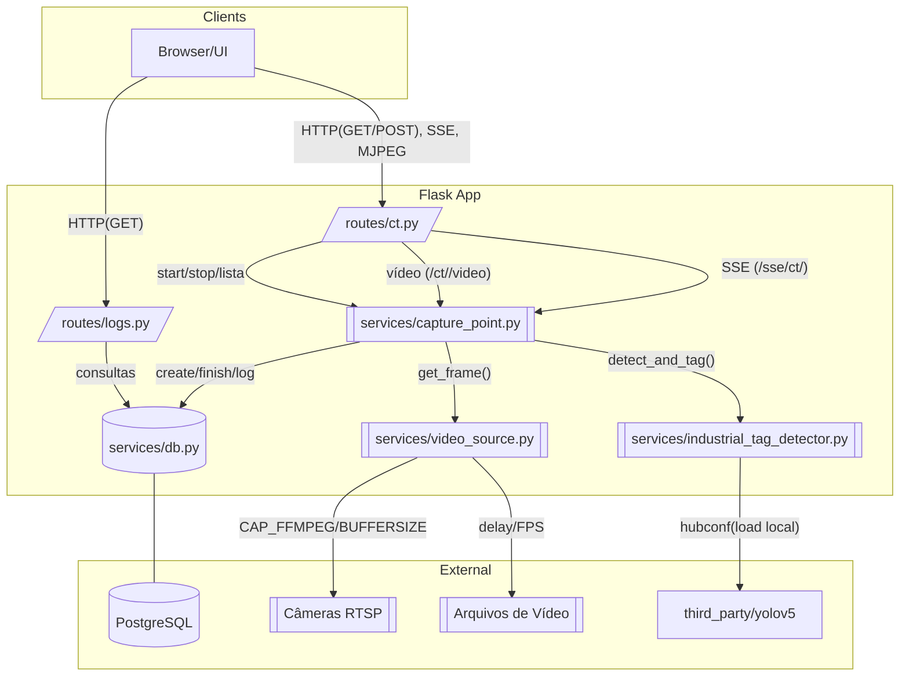
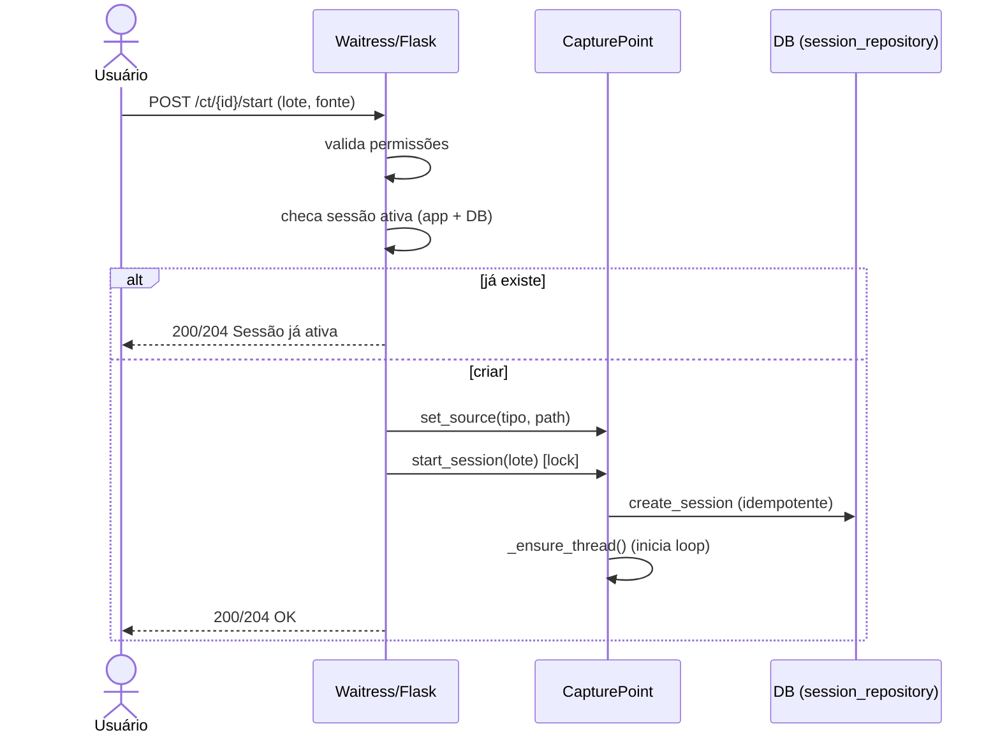
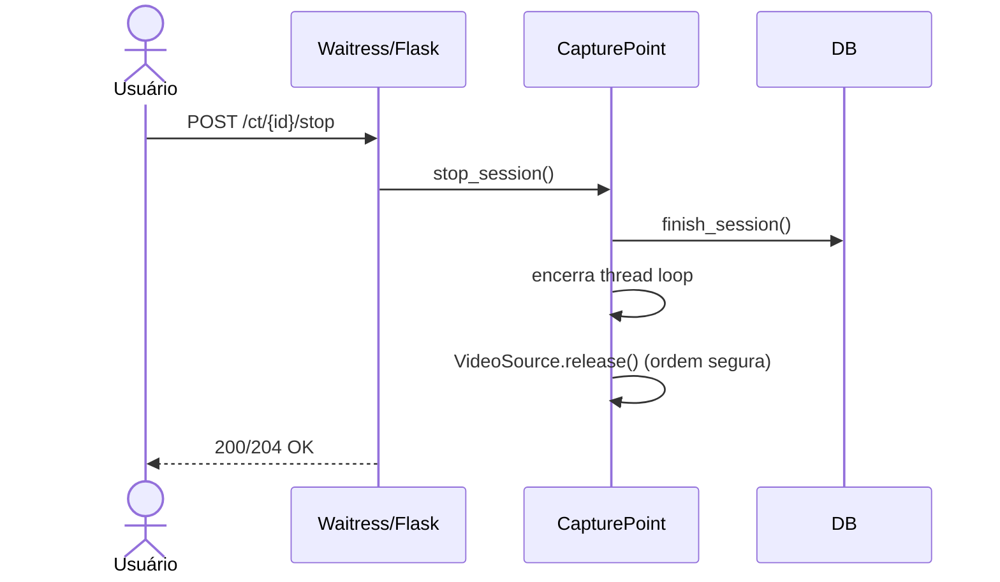
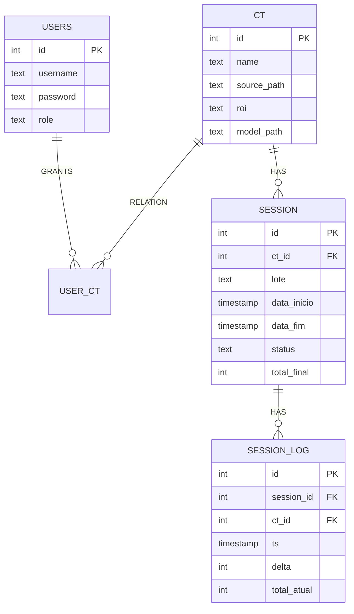

Arquitetura, Fluxos e Diagramas

Este documento complementa o README principal com diagramas (Mermaid) e detalhamento de fluxos, para facilitar manutenção por novos desenvolvedores.

Arquitetura (alto nível)



Pipeline de processamento

```mermaid
flowchart LR
  A[Frame capturado] --> B[Filtro ROI]
  B --> C[YOLOv5 detect]
  C --> D[Filtra classe/confiança]
  D --> E[Associa/atualiza objetos]
  E --> F[Máquina de estados<br/>(duplo cruzamento)]
  F --> G[Atualiza contador]
  G --> H[Log de deltas (DB)]
  E --> I[Desenho BBox/linhas/labels]
  I --> J[Frame para /video]
```

Sequência — Start de sessão



Sequência — Stop de sessão



Modelo de dados (ER simplificado)



Pontos de manutenção importantes
- Sessão única por CT: protegido por aplicação (lock/idempotência) e por índice único parcial no DB.
- Encerramento limpo: `services/capture_point.py.stop_session()` + `services/video_source.py.release()`.
- Tuning de performance: Waitress (`--threads`, `--connection-limit`), SSE interval, CAP_PROP_BUFFERSIZE.
- Logs/observabilidade: redirecionar stdout/stderr; ver `logs/service.out|err` quando rodar como serviço.

Runbook resumido
- Iniciar (console): `waitress-serve --host 0.0.0.0 --port 80 --threads 64 --connection-limit 500 --channel-timeout 300 --call app:create_app`
- Iniciar (serviço): `python windows_service.py install|start` (ajuste `windows_service.ini` se necessário)
- Backup: `pg_dump -h <host> -U <user> -d contagem_sacaria -F c -f backup.dump`
- Restore: `pg_restore -h <host> -U <user> -d contagem_sacaria -c backup.dump`

