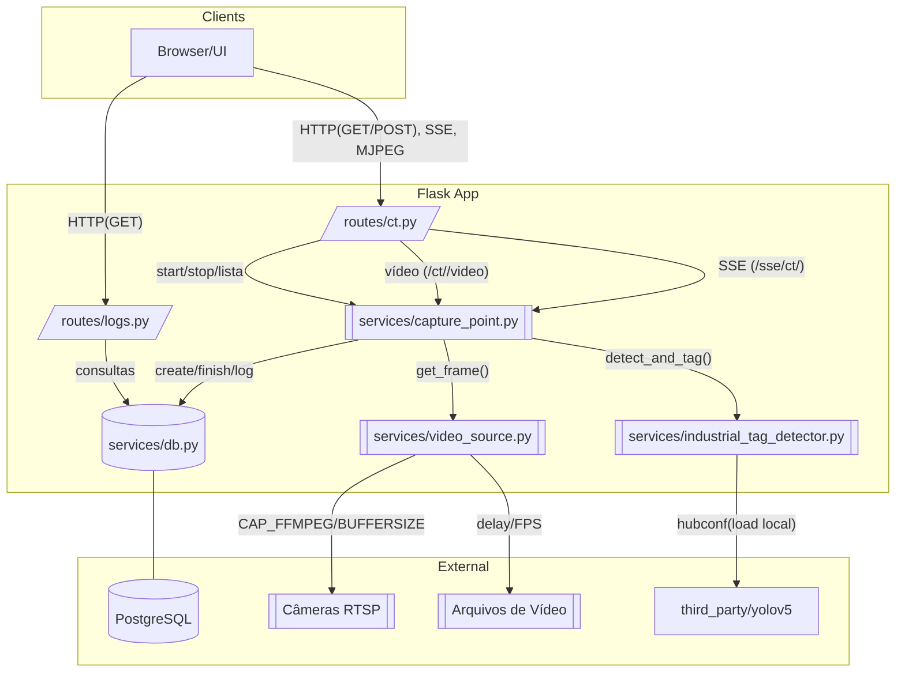
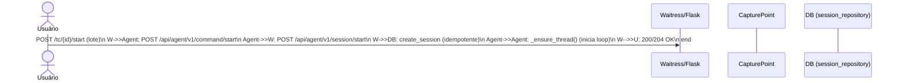

Arquitetura, Fluxos e Diagramas

Este documento complementa o README principal com diagramas (Mermaid) e detalhamento de fluxos, para facilitar manutenção por novos desenvolvedores.

Arquitetura (alto nível)

```mermaid
graph TD
  subgraph Clients
    B[Browser/UI]
  end

  subgraph App[Flask App]
    R1[/routes/ct.py/]
    R2[/routes/logs.py/]
    S1[[services/capture_point.py]]
    S2[[services/video_source.py]]
    S3[[services/industrial_tag_detector.py]]
    DB[(services/db.py)]
  end

  subgraph External
    P[(PostgreSQL)]
    RTSP[[Câmeras RTSP]]
    FILE[[Arquivos de Vídeo]]
    YOLO[third_party/yolov5]
  end

  B -- HTTP(GET/POST), SSE, MJPEG --> R1
  B -- HTTP(GET) --> R2
  R1 -- start/stop/lista --> S1
  R1 -- vídeo (/ct/<id>/video) --> S1
  R1 -- SSE (/sse/ct/<id>) --> S1
  R2 -- consultas --> DB
  S1 -- get_frame() --> S2
  S1 -- detect_and_tag() --> S3
  S3 -- hubconf(load local) --> YOLO
  S1 -- create/finish/log --> DB
  DB --- P
  S2 -- CAP_FFMPEG/BUFFERSIZE --> RTSP
  S2 -- delay/FPS --> FILE
```

Pipeline de processamento

```mermaid
flowchart LR
  A[Frame capturado] --> B[Filtro ROI]
  B --> C[YOLOv5 detect]
  C --> D[Filtra classe/confiança]
  D --> E[Associa/atualiza objetos]
  E --> F[Máquina de estados<br/>(duplo cruzamento)]
  F --> G[Atualiza contador]
  G --> H[Log de deltas (DB)]
  E --> I[Desenho BBox/linhas/labels]
  I --> J[Frame para /video]
```

Sequência — Start de sessão

```mermaid
sequenceDiagram
  actor U as Usuário
  participant W as Waitress/Flask
  participant CT as CapturePoint
  participant DB as DB (session_repository)

  U->>W: POST /tc/{id}/start (lote)\n  W->>Agent: POST /api/agent/v1/command/start\n  Agent->>W: POST /api/agent/v1/session/start\n  W->>DB: create_session (idempotente)\n  Agent->>Agent: _ensure_thread() (inicia loop)\n  W-->>U: 200/204 OK\n  end
```

Sequência — Stop de sessão

```mermaid
sequenceDiagram
  actor U as Usuário
  participant W as Waitress/Flask
  participant CT as CapturePoint
  participant DB as DB

  U->>W: POST /tc/{id}/stop\n  W->>Agent: POST /api/agent/v1/command/stop\n  Agent->>W: POST /api/agent/v1/session/finish\n  W->>DB: finish_session()\n  Agent->>Agent: encerra thread loop / release()\n  W-->>U: 200/204 OK\n  end

  subgraph Central[Servidor Central]
    BP[/routes/*.py/]
    RT[services/runtime.py (shadow)]
    SR[(services/session_repository.py)]
    DB[(PostgreSQL)]
  end

  subgraph Agent1[Agente Local (PC do ponto)]
    CAP1[[services/capture_point.py]]
    VS1[[services/video_source.py]]
    YOLO1[third_party/yolov5]
  end

  UI -- HTTP/SSE --> BP
  BP -- shadow(SSE) --> RT
  BP -- persist --> SR
  SR --- DB

  CAP1 -- frames --> VS1
  CAP1 -- detect --> YOLO1
  CAP1 -- HTTP POST eventos --> BP
  BP -- HTTP POST comandos --> CAP1
```
